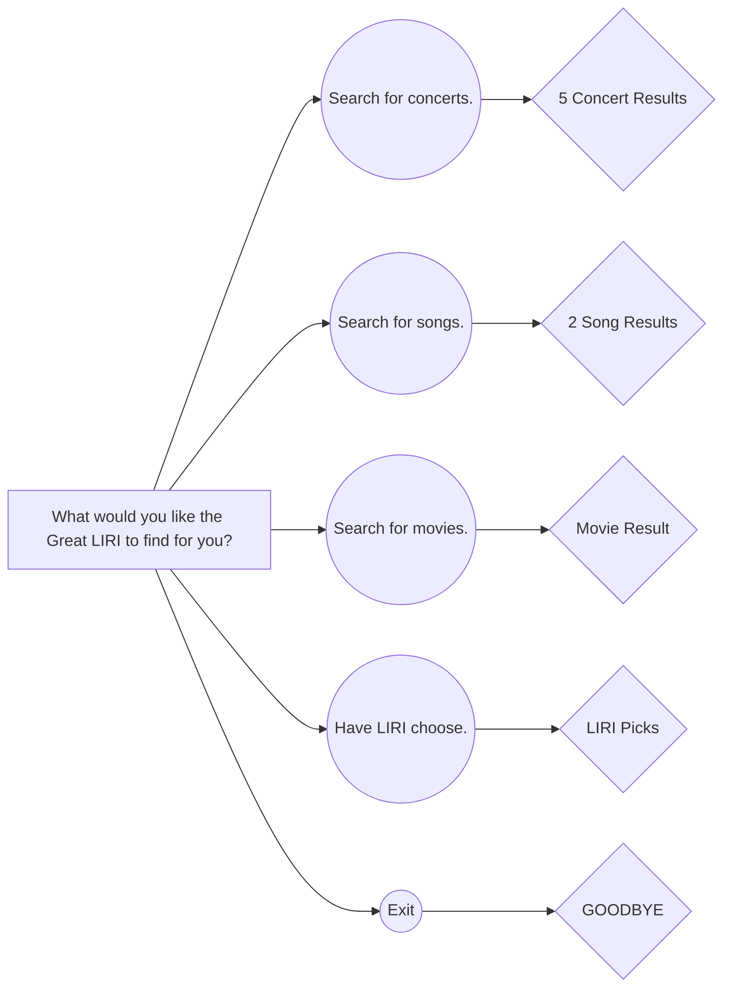

# LIRI Bot-node
 LIRI is a Language Interpretation and Recognition Interface. LIRI is a command line node app that takes in parameters and gives you back data.

## Demo
[](https://drive.google.com/file/d/1LZMRPTI_9mAuJ2CG55E4g6KnoRYvcXGz/preview "LIRI")

## Link to GitHub

[LIRI](https://github.com/JCCALL/LIRI-node-app.git "LIRI")

## How to install
1.  Clone the files to your computer:
```gitbash
git clone https://github.com/JCCALL/liri-node-app.git
```
2. Go into the file in gitbash/terminal and npm install the needed files:
```gitbash
npm install
```
3. Create a `.env` file inside the directory and copy paste the following:
```
# Spotify API keys

SPOTIFY_ID=f0d3dc56043c4955beef30ccacc68cb3
SPOTIFY_SECRET=be2ab6c918514b3f808422a3962a3ac9
```
4. Put the following in your terminal/gitbash/console and the following interaction will occur:
```
node liri.js
```



5. Follow the instructions, have fun.

## Made with
- Javascript
- Node
- NPM

## APIs
- Bands In Town
- Node Spotify
- OMDb

## NPMs
- Axios
- Inquirer
- Moment
- Dotenv

## Creator
Jordan Call
